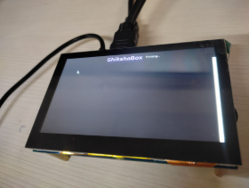
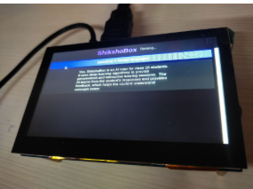
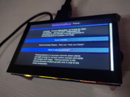

# 📚 ShikshaBox

> An Offline Voice-Based AI Educational Assistant for Class 10 Students in Low-Connectivity Regions


## 🌟 Overview

ShikshaBox is an offline AI-powered educational assistant designed for students who have limited or no internet access. Running entirely on a Raspberry Pi, it enables students to ask questions using voice or text and receive syllabus-based answers without relying on cloud services.

The system combines Speech-to-Text, a lightweight Large Language Model, Retrieval-Augmented Generation (RAG), and Text-to-Speech to provide an interactive learning experience while remaining fully offline.

---

## 🎯 Problem Statement

Many students in rural and remote areas face challenges such as:

- Poor or no internet connectivity
- Lack of qualified teachers
- Limited access to digital educational resources
- Expensive cloud-based AI solutions

ShikshaBox addresses these challenges by bringing AI-powered education directly to the classroom without requiring an internet connection.

---

# ✨ Features

- 🎤 Voice-based interaction
- 💬 Text-based question answering
- 📖 NCERT syllabus-based responses
- 🤖 Offline AI inference
- 🔍 Retrieval-Augmented Generation (RAG)
- 🗣️ Hindi Text-to-Speech
- ⚡ Fast on-device processing
- 📴 No internet required
- 💻 Touchscreen interface
- 📚 Curriculum-focused learning

---

# 🏗️ System Architecture

```
             Student
        (Voice / Text)
               │
               ▼
      Speech-to-Text (Whisper)
               │
               ▼
        Query Processing
               │
               ▼
      NCERT Knowledge Base
               │
               ▼
      TinyLlama Language Model
               │
               ▼
      Response Generation
               │
               ▼
      Text-to-Speech (Piper)
               │
               ▼
        Audio + Screen Output
```

---

# 🛠 Tech Stack

## Hardware

- Raspberry Pi 5 (8GB)
- USB Microphone
- Touchscreen Display
- Bluetooth Speaker
- 64GB MicroSD Card

## Software

- Python
- Whisper.cpp
- TinyLlama (GGUF)
- llama.cpp
- Piper TTS
- ChromaDB / Local Vector Store
- SQLite
- Tkinter GUI

---

# 📂 Project Structure

```
ShikshaBox/
│
├── models/
│   ├── tinyllama.gguf
│   ├── whisper-model.bin
│
├── dataset/
│   ├── NCERT/
│
├── gui/
│
├── rag/
│
├── speech/
│   ├── stt.py
│   ├── tts.py
│
├── chatbot.py
├── app.py
├── requirements.txt
└── README.md
```

---

# 🚀 How It Works

1. Student asks a question using voice.
2. Whisper converts speech into text.
3. The question is matched with the NCERT knowledge base.
4. Relevant educational content is retrieved.
5. TinyLlama generates a syllabus-focused response.
6. Piper converts the response into speech.
7. The answer is displayed on the touchscreen and spoken aloud.

---

# 📷 Screenshots

## 🏠 Home Screen

The welcome screen displayed when ShikshaBox starts.



---

## 🎤 Listening Mode

The assistant listens to the student's question through the connected USB microphone.



---

## 🤖 Answer Generation

After processing the question, ShikshaBox generates a curriculum-based response and displays it on the screen while reading it aloud.



---

# ⚙️ Installation

Clone the repository

```bash
git clone https://github.com/yourusername/ShikshaBox.git
```

Move into the project

```bash
cd ShikshaBox
```

Install dependencies

```bash
pip install -r requirements.txt
```

Run the application

```bash
python app.py
```

---

# 📚 Dataset

The educational content is based on the **NCERT Class 10 curriculum**.

Subjects include:

- Mathematics
- Science
- English
- Social Science

The dataset is preprocessed and indexed locally for offline retrieval.

---

# 🔍 AI Pipeline

```
Voice Input
      │
      ▼
 Speech-to-Text
      │
      ▼
 Query Processing
      │
      ▼
 Local Knowledge Retrieval
      │
      ▼
 TinyLlama
      │
      ▼
 Answer Generation
      │
      ▼
 Text-to-Speech
      │
      ▼
 Student
```

---

# 📈 Future Improvements

- Multiple Indian language support
- Improved RAG using embeddings
- Student progress tracking
- Quiz generation
- Teacher dashboard
- Offline exam preparation mode
- Better voice recognition in noisy environments

---

# 🎓 Research

This project was developed as a Final Year Engineering Project.

**Title**

**ShikshaBox: An Offline Voice-Based AI Educational Assistant for Class 10 Learners in Low-Connectivity Regions**

---

# 👨‍💻 Authors

- Chetan Sawale
- Daivesh Chaudhari
- Nikhil Gaikwad
- Tanmay Tandel

Guide:
**Prof. Anisha Parpanathan**

---

# 📄 License

This project is released under the MIT License.

---

# ⭐ Support

If you found this project useful, consider giving it a ⭐ on GitHub.
